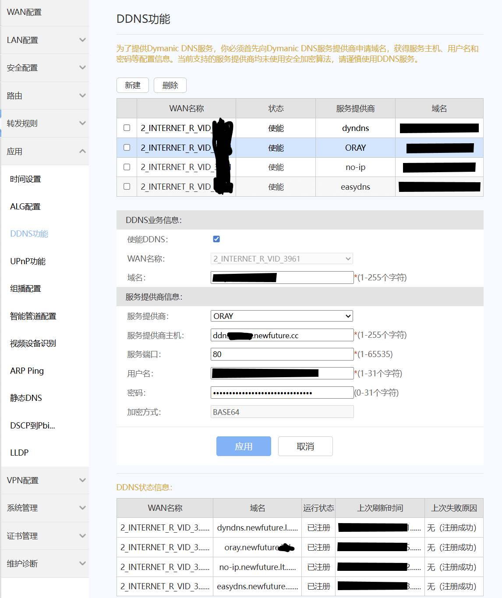

# edge-ddns-proxy

> 通过传统路由器/光猫的 DDNS 功能自动更新现代 DNS 服务商的解析记录

[English](README.en.md) | 简体中文

---

## 📋 概述

[**edge-ddns-proxy**](https://github.com/NewFuture/edge-ddns-proxy) 是一个运行在边缘计算平台（阿里云、腾讯云、Cloudflare）上的无服务器中间代理服务。它在路由器/光猫使用的传统 DDNS 协议与现代 DNS 服务商 API 之间架起桥梁，使老旧设备能够在现代 DNS 管理平台上更新 DNS 记录，无需运行额外的客户端程序。

### 🔄 工作原理

```
       ┌─────────────────────┐
       │    光猫/路由器       │
       │    内置 DDNS 客户端  │
       └─────────────────────┘
                 │
            传统 DDNS 协议
       (DynDNS/no-ip/EasyDNS/qdns等)
                 │
                 ▼
       ┌─────────────────────┐
       │  edge-ddns-proxy    │
       │     (边缘函数)       │
       │     协议转换层       │
       └─────────────────────┘
                 │
       现代 DNS 服务商 API
                 │
                 ▼
       ┌─────────────────────┐
       │     DNS 服务商       │
       │   - Cloudflare      │
       │   - 阿里云 DNS       │
       │   - 腾讯云 DNS       │
       └─────────────────────┘
```
### 🎯 使用场景

此解决方案适用于以下场景：

1. ✅ 您的路由器/光猫仅支持传统 DDNS 协议（DynDNS、no-ip 等）
2. ✅ 您的域名使用现代 DNS 服务商（Cloudflare、阿里云 DNS、腾讯云 DNS 等）管理

> 如果你想在客户端运行DDNS来更新你的IPv6地址或者更定制化的需求，可以使用 https://github.com/NewFuture/DDNS

#### 📡 支持的 DDNS 协议

- **DynDNS** - 经典动态 DNS 协议
- **oray (花生壳)** - 国内流行的DDNS服务商
- **no-ip** - No-IP DDNS 协议
- **EasyDNS** - EasyDNS 更新协议
- **qdns** - QDNS 协议及类似服务


#### ☁️ 支持 DNS 云厂商
- Cloudflare
- 阿里云 DNS (AccessKey)
- 腾讯云 DNS (DNSPod Accesskey)
- 欢迎添加


### 🚀 快速开始



#### 前置条件

- 支持传统 DDNS 功能的路由器或光猫设备
- 域名托管在阿里云，腾讯云，或者 Cloudflare DNS 服务商的 API 访问权限

#### 基本配置步骤

- 配置 DNS 服务商的 API 凭证（AccessKey、SecretKey 等）
- 记录代理服务的访问 URL

#### 📝 配置示例

路由器 DDNS 设置：
```
主机名：yourdomain.com
服务提供商：DynDNS 系列，或者 no-ip、EasyDNS、Oray均可
DDNS 服务器：edge-ddns-proxy.edge-platform.com
用户名：your-key
密码：your-api-token
```

### 🔒 安全性说明

⚠️ **重要提示**：

- 传统路由器的 DDNS 协议大多使用 **HTTP 明文传输**（非 HTTPS），在光猫/路由器到边缘节点的链路上存在被截获的理论风险
- 建议使用 **最小权限原则** 配置 API 密钥，仅授予 DNS 记录更新权限
- 代理服务应设置访问控制，避免未授权访问
- 如需限制可更新的域名，设置环境变量 `ALLOWED_SUFFIX`（逗号分隔域名后缀，如 `.example.com,.newfuture.cc`），其他域名将被拒绝
- 定期检查和更新 API 凭证

### 📚 技术细节

**数据流转过程：**

1. 📡 路由器检测到公网 IP 变化，发送标准 DDNS 更新请求（HTTP GET/POST）
2. 🔄 edge-ddns-proxy 接收并解析传统 DDNS 协议请求
3. 🔍 代理提取关键信息：IP 地址、主机名、认证信息
4. ✅ 验证请求合法性并提取目标域名
5. 🌐 调用对应 DNS 服务商的现代 API 接口更新记录
6. ✔️ 将更新结果转换为标准 DDNS 响应返回给路由器

**支持的边缘计算平台：**
- [阿里云ESA](https://common-buy.aliyun.com/?commodityCode=dcdn_dcdnserviceplan_public_cn&orderType=RENEW&instanceId=esa-site-b1da082k62v4)
- [腾讯云EdgeOne](https://edgeone.cloud.tencent.com/)
- [Cloudflare Workers](https://workers.cloudflare.com/)

---

## 🚢 部署指南

### 阿里云 ESA Function 部署

#### 方式一：手动粘贴代码部署

1. **登录阿里云 ESA 控制台**
   - 访问 [阿里云 ESA 控制台](https://esa.console.aliyun.com/)
   - 进入 **边缘函数** > **函数管理**

2. **创建新函数**
   - 点击 **创建函数**
   - 选择 **从头创建**
   - 函数名称：`edge-ddns-proxy`（或自定义名称）

3. **配置函数代码**
   - 在代码编辑器中，删除默认代码
   - 复制本仓库的 [`index.js`](./index.js) 文件内容
   - 粘贴到代码编辑器中

4. **配置环境变量（可选）**
   - 点击 **环境变量** 标签
   - 添加环境变量：
     - `ALLOWED_SUFFIX`：允许的域名后缀（逗号分隔），如 `.example.com,.newfuture.cc`
     - `DDNS_KV`：KV 命名空间绑定（用于缓存，可选）

5. **保存并发布**
   - 点击 **保存**
   - 点击 **发布** 将函数发布到生产环境

6. **配置路由**
   - 在 **路由管理** 中添加路由规则
   - 匹配条件：例如 `/*` 或特定路径
   - 绑定到刚创建的函数

7. **获取访问地址**
   - 在函数详情页查看分配的边缘函数域名
   - 或绑定自定义域名

#### 方式二：GitHub 仓库自动部署

1. **准备 GitHub 仓库**
   - Fork 本仓库：https://github.com/NewFuture/edge-ddns-proxy
   - 或使用您自己的仓库

2. **登录阿里云 ESA 控制台**
   - 访问 [阿里云 ESA 控制台](https://esa.console.aliyun.com/)
   - 进入 **边缘函数** > **函数管理**

3. **创建新函数并关联 GitHub**
   - 点击 **创建函数**
   - 选择 **从 GitHub 导入**
   - 首次使用需要点击 **关联 GitHub 账号** 并授权

4. **选择仓库和分支**
   - 在授权成功后，选择您的仓库
   - 选择部署分支（通常是 `main` 或 `master`）

5. **配置构建设置**
   - **入口文件**：`./index.js`（或在 `esa.jsonc` 中定义）
   - **根目录**：保持默认 `/`
   - **构建命令**：留空（本项目无需构建）
   - **环境变量**：
     - `ALLOWED_SUFFIX`：允许的域名后缀（可选）

6. **保存并部署**
   - 点击 **保存并部署**
   - ESA 将自动从 GitHub 拉取代码并部署

7. **自动同步**
   - 每次推送代码到指定分支时，ESA 会自动重新部署
   - 可在部署历史中查看每次部署的状态

8. **配置路由和域名**
   - 在 **路由管理** 中配置路由规则
   - 绑定自定义域名（可选）

#### 部署后配置

部署完成后，您将获得一个边缘函数访问地址，例如：
```
https://your-function.esa-cn-shenzhen.fcapp.run
```

在路由器的 DDNS 设置中使用此地址：
```
DDNS 服务器：your-function.esa-cn-shenzhen.fcapp.run
用户名：<您的 DNS 服务商 AccessKey>
密码：<您的 DNS 服务商 SecretKey>
主机名：yourdomain.com
```

---

## 📄 开源协议

本项目采用 [Apache 协议](LICENSE) 开源。

## 🤝 参与贡献

欢迎提交 Issue 和 Pull Request！

## 📮 获取帮助

如有问题或需要帮助，请[提交 Issue](https://github.com/NewFuture/edge-ddns-proxy/issues)。

## 网页
